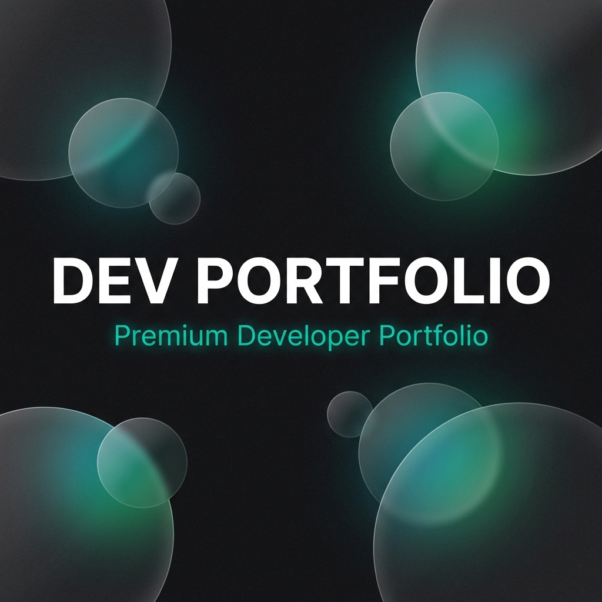

# DEV PORTFOLIO - Premium Open Source Portfolio Template


A modern, high-performance developer portfolio template built with **Next.js 16**, **React 19**, **Tailwind CSS v4**, and **GSAP** animations. Designed for developers who value aesthetics, performance, and clean code.



## ✨ Key Features

- **🎨 Modern Aesthetics** - Minimalist design with glassmorphism, smooth gradients, and noise textures.
- **⚡ Super Fast** - Built on Next.js 16 (Turbopack) for optimal performance and SEO.
- **🌊 Smooth Animations** - Integrated **Lenis** for buttery smooth scrolling and **GSAP** for scroll-triggered reveal effects.
- **🌗 Dark/Light Mode** - System-aware theme toggle with liquid transition effects.
- **📱 Fully Responsive** - Mobile-first approach ensuring a perfect experience on all devices.
- **🛠 Easy Customization** - Centralized configuration file (`site.ts`) to manage content without touching code.
- **📝 Dynamic Case Studies** - showcase your work with rich details, statistics, and storytelling elements.
- **🔍 SEO Optimized** - Automated Sitemap generation, Robots.txt, and Open Graph metadata.

## 🚀 Getting Started

Follow these steps to get your portfolio up and running in minutes.

### Prerequisites

- Node.js 18+ or Bun
- npm, yarn, pnpm, or bun

### Installation

1. **Clone the repository**

   ```bash
   git clone https://github.com/yourusername/portfolio-template.git
   cd portfolio-template
   ```

2. **Install dependencies**

   ```bash
   npm install
   # or
   bun install
   ```

3. **Start the development server**

   ```bash
   npm run dev
   # or
   bun dev
   ```

   Open [http://localhost:3000](http://localhost:3000) to view it in the browser.

## 🎨 Customization Guide

### 1. Personalize Content
Navigate to `src/config/site.ts`. This single file contains all your personal information, social links, and SEO settings.

```typescript
export const siteConfig = {
  name: "Your Name",
  role: "Full-Stack Developer",
  // ...
};
```

### 2. Add Projects
Edit `src/data/case-studies.ts` to add your projects. The template supports rich content including tech stacks, challenges, and outcomes.

### 3. Adjust Theme
To change the primary brand color, modify `src/app/globals.css`:

```css
@theme inline {
  --color-primary: #1f6b75; /* Change this hex code */
}
```

## 📁 Project Structure

```
├── public/          # Static assets (images, fonts)
├── src/
│   ├── app/         # Next.js App Router pages
│   ├── components/  # Reusable UI components
│   ├── config/      # Site-wide configuration
│   ├── data/        # Static content data
│   └── hooks/       # Custom React hooks
```

## 🚀 Deployment

The easiest way to deploy is using [Vercel](https://vercel.com). Code is pushed? You are live.

[](https://vercel.com/new/clone?repository-url=https%3A%2F%2Fgithub.com%2Fyourusername%2Fportfolio-template)

1. Push your code to a GitHub repository.
2. Import the project into Vercel.
3. Vercel will automatically detect Next.js and deploy.

## 📄 License

This project is open source and available under the **MIT License**. You are free to use, modify, and distribute it for personal or commercial projects.

See [LICENSE.md](LICENSE.md) for details.

## 🤝 Contributing

Contributions are welcome! If you find a bug or want to feature, feel free to open an issue or submit a pull request.

---

Built with ❤️ by [Nandhu](https://github.com/Nandhu125)
